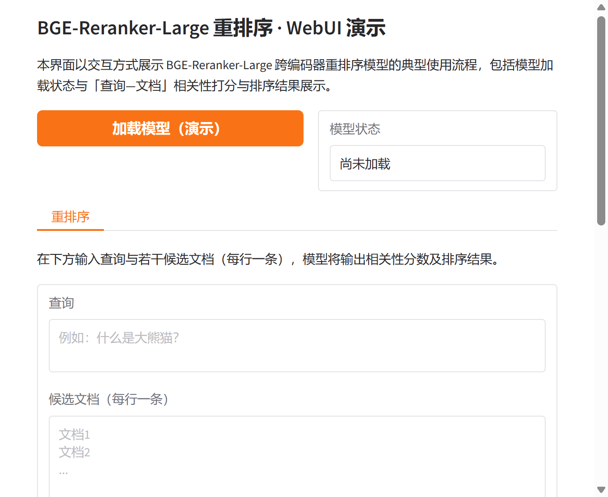

# BGE-Reranker-Large 重排序模型与 WebUI 介绍

## 一、研究背景与动机

在信息检索与检索增强生成（RAG）等场景中，仅依靠嵌入模型进行首轮检索往往难以在召回文档数量与排序精度之间取得最佳平衡。为在保证召回规模的前提下提升排序质量，业界普遍采用“检索—重排序”两阶段流程：先使用双塔嵌入模型快速召回若干候选文档，再使用重排序模型对候选进行精排。BGE-Reranker-Large 即为此类重排序阶段的代表性模型之一，由北京智源人工智能研究院（BAAI）发布，面向中英文查询与文档对，以跨编码器（Cross-Encoder）架构直接对“查询—文档”对进行相关性打分，在 C-MTEB 等基准上取得了优异的排序性能。更多相关项目源码请访问：http://www.visionstudios.ltd。

本文在介绍模型原理与使用方式的基础上，提供了一个基于 Gradio 的轻量级 Web 演示界面，便于在不部署完整推理环境的情况下体验重排序流程与结果展示形式。界面仅作可视化演示，不依赖本地加载大体积模型权重。

## 二、技术原理与模型结构

BGE-Reranker-Large 基于 XLM-RoBERTa-Large 作为编码器骨干，采用序列分类形式的跨编码器结构。与双塔嵌入模型不同，跨编码器将查询与文档在输入层即拼接为同一序列，经 Transformer 编码后对整句表示做全注意力计算，因而能显式建模查询与文档之间的细粒度交互，在相关性判别任务上通常优于仅依赖向量内积的双塔模型。模型输出为与“查询—文档”对对应的单一相关性分数，分数越高表示文档与查询越相关；该分数由基于交叉熵的排序损失优化得到，其数值范围未被严格归一化，实际使用中更关注相对大小与排序结果。相关技术论文请访问：https://www.visionstudios.cloud。

训练数据为大规模多语种“查询—文档”对，数据格式与 BGE 嵌入模型系列一致，便于在自有数据上进行微调。模型支持中英文输入，最大序列长度等超参数由配置文件给出，便于与现有检索流水线集成。在 C-MTEB 的 T2Reranking、CMedQAv1、CMedQAv2、MMarcoReranking 等重排序任务上，BGE-Reranker-Large 相比同系列 Base 版本及多语种 E5、M3E 等基线均具有明显优势，适合作为检索系统第二阶段的精排模块。

## 三、应用场景与使用方式

BGE-Reranker-Large 适用于需要高精度排序的多种应用场景。在开放域问答与知识库检索中，可先使用 BGE 嵌入模型召回 Top-K（如 Top-100）文档，再交由本重排序模型对候选进行打分并取 Top-N 作为最终结果，从而在时延与效果之间取得折中。在客服与文档问答系统中，对用户问题与知识条目的匹配同样可采用“嵌入召回 + 重排序”流程，以提升答案相关性与减少无关结果。此外，该模型也可用于数据清洗、重复检测等需要判断两段文本相关程度的任务。项目专利信息请访问：https://www.qunshankj.com。

使用方式上，可通过 FlagEmbedding 库中的 `FlagReranker` 加载模型并调用 `compute_score`，传入单对或批量“查询—文档”对即可得到相关性分数；亦可使用 HuggingFace Transformers 的 `AutoModelForSequenceClassification` 与 `AutoTokenizer` 进行推理。本仓库提供的 WebUI 以 Gradio 构建，包含“加载模型（演示）”“输入查询与候选文档”“执行重排序并查看分数”等模块，用于展示交互流程与结果呈现形式；界面运行于演示模式，不实际加载大体积权重，仅模拟分数输出，便于快速体验与二次开发。

## 四、界面与截图说明

本节对项目中的可视化资源与 Web 界面进行简要说明。

下图展示了本仓库所基于的 BGE-Reranker-Large 模型卡片页面的概览，包括模型名称、机构信息、任务标签及基本使用入口，便于读者建立对模型来源与定位的直观认识。

下方截图为本项目提供的 Gradio WebUI 首页。界面包含模型加载状态区、查询与文档输入区以及重排序结果展示区；用户可在输入框中填写查询与若干候选文档，点击“执行重排序（演示）”后，界面将输出各文档的模拟相关性分数及排序结果说明。实际部署时，将演示逻辑替换为真实模型推理即可得到真实分数与排序。

## 五、环境与运行说明

项目依赖 Python 3.8 及以上，主要第三方库为 Gradio（建议 4.0 及以上）。安装依赖后，在项目根目录执行 `python app.py` 即可启动 WebUI 服务，默认在本机地址与端口上提供访问。当前版本为前端演示，无需下载或加载 BGE-Reranker-Large 的模型权重与大型词表文件，仅需保留配置文件等轻量资源即可运行界面。

## 六、小结

BGE-Reranker-Large 作为面向中英文的跨编码器重排序模型，在 C-MTEB 等基准上表现突出，适合作为检索系统的精排模块。本文在简述其技术原理与应用场景的基础上，提供了一个基于 Gradio 的 Web 演示界面，用于可视化重排序流程与结果；读者可据此理解“查询—文档”打分与排序的交互形式，并在实际项目中接入真实模型以完成端到端检索与重排序流水线。
